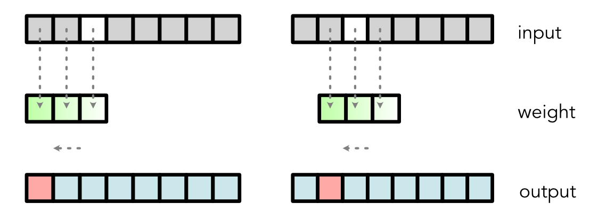

# minitorch diagrams

This repo reimplements the minitorch diagrams using the Chalk library for python diagramming.
figs/Autograd/backprop6.png

figs/Autograd/chain1.png

figs/Autograd/fondo.png

figs/Autograd/autograd1@2x.png

figs/Autograd/autograd2.png

figs/Autograd/backprop1.png

figs/Autograd/backprop7.png

figs/Autograd/autograd1.png

figs/Autograd/backprop5.png

figs/Autograd/autograd5@2x.png

figs/Autograd/autograd3.png

figs/Autograd/backprop4.png

figs/Autograd/chain2@2x.png

figs/Autograd/chain3.png

figs/Autograd/sector1.png

figs/Autograd/autograd4.png

figs/Autograd/autograd5.png

figs/Autograd/backprop3.png

figs/Autograd/autograd2@2x.png

figs/Autograd/backprop2.png

figs/Autograd/chain2.png

figs/Broadcast/fondo.png

figs/Broadcast/scalar.png

figs/Broadcast/threed.png

figs/Broadcast/vector.png

figs/Broadcast/matmul.png

figs/Conv/pool2d.png

figs/Conv/pool4.png

figs/Conv/fondo.png

figs/Conv/conv2.png

figs/Conv/pool2.png

figs/Conv/value.png

figs/Conv/channels.png

figs/Conv/sector2.png

figs/Conv/convvec.png

figs/Conv/max.png

figs/Conv/im1.png

figs/Conv/argmax.png

figs/Conv/conv1dback.png

figs/Conv/networkcnn.png

figs/Conv/conv.png

figs/Conv/conv1d.png

figs/Conv/conv2@3x.png

figs/Conv/im2.png

figs/Conv/pool3.png

figs/Conv/pool1.png

figs/Conv/sector1.png

figs/Conv/convchan.png

figs/Conv/softmax.png

figs/Conv/mnist.png

figs/Conv/conv1dback2.png

figs/Conv/backward.png

figs/Conv/pool2d@3x.png

figs/Conv/conv@3x.png

figs/gpu/blockid.png

figs/gpu/local mem@3x.png

figs/gpu/block1d@3x.png

figs/gpu/fondo.png

figs/gpu/thread.png

figs/gpu/blockid@3x.png

figs/gpu/block.png

figs/gpu/sharedmem@3x.png

figs/gpu/sharedmem.png

figs/gpu/map@3x.png

figs/gpu/threadid@3x.png

figs/gpu/block1d.png

figs/gpu/map.png

figs/gpu/blockdim.png

figs/gpu/thread@3x.png

figs/gpu/block@3x.png

figs/gpu/local mem.png

figs/gpu/blockdim@3x.png

figs/gpu/threadid.png

figs/Grad/tangent.png

figs/Grad/fondo.png

figs/Grad/function.png

figs/Grad/approx.png

figs/Graphs/pt2@3x.png

figs/Graphs/relu@3x.png

figs/Graphs/relu.png

figs/Graphs/pt3.png

figs/Graphs/data@3x.png

figs/Graphs/fondo.png

figs/Graphs/split1.png

figs/Graphs/data5.png

figs/Graphs/relu2@3x.png

figs/Graphs/weight.png

figs/Graphs/sector1@3x.png

figs/Graphs/sector2.png

figs/Graphs/sector3@3x.png

figs/Graphs/data3.png

figs/Graphs/splitfail.png

figs/Graphs/data2.png

figs/Graphs/bias.png

figs/Graphs/model1.png

figs/Graphs/sector2@3x.png

figs/Graphs/mlp@3x.png

figs/Graphs/model2.png

figs/Graphs/pt1.png

figs/Graphs/move.png

figs/Graphs/data.png

figs/Graphs/relu2.png

figs/Graphs/incorrect.png

figs/Graphs/pt2.png

figs/Graphs/split1@3x.png

figs/Graphs/sigmoid2.png

figs/Graphs/split@3x.png

figs/Graphs/weight@3x.png

figs/Graphs/mlpmid@3x.png

figs/Graphs/split2@3x.png

figs/Graphs/split.png

figs/Graphs/model3.png

figs/Graphs/pt1@3x.png

figs/Graphs/data1.png

figs/Graphs/sector1.png

figs/Graphs/download.png

figs/Graphs/distance.png

figs/Graphs/bias@3x.png

figs/Graphs/mlpgraph.png

figs/Graphs/mlp.png

figs/Graphs/split2.png

figs/Graphs/model2@3x.png

figs/Graphs/incorrect3.png

figs/Graphs/data4.png

figs/Graphs/distance@3x.png

figs/Graphs/sigmoid.png

figs/Graphs/mlpmid.png

figs/Graphs/pt3@3x.png

figs/Graphs/incorrect@3x.png

figs/Graphs/sector3.png

figs/mnist/mnist2.png

figs/mnist/orig.png

figs/mnist/mnist5.png

figs/mnist/mnist3.png

figs/mnist/mnist.png

figs/mnist/mnist4.png

figs/Module/module.png

figs/Module/fondo.png

figs/NLP/sector6.png

figs/NLP/embone.png

figs/NLP/fondo.png

figs/NLP/positive.png

figs/NLP/sentemb.png

figs/NLP/batch.png

figs/NLP/pooling.png

figs/NLP/weight.png

figs/NLP/sector2.png

figs/NLP/bias.png

figs/NLP/sector10.png

figs/NLP/sector4.png

figs/NLP/senthot.png

figs/NLP/weight2.png

figs/NLP/sector12.png

figs/NLP/sector11.png

figs/NLP/embweight.png

figs/NLP/sector1.png

figs/NLP/sector7.png

figs/NLP/sector5.png

figs/NLP/full.png

figs/NLP/sector9.png

figs/NLP/onehot.png

figs/NLP/negative.png

figs/NLP/sector8.png

figs/NLP/sector3.png

figs/NLP /sector6.png

figs/NLP /sector2.png

figs/NLP /sector10.png

figs/NLP /sector4.png

figs/NLP /sector12.png

figs/NLP /sector11.png

figs/NLP /sector1.png

figs/NLP /sector7.png

figs/NLP /sector5.png

figs/NLP /sector9.png

figs/NLP /sector8.png

figs/NLP /sector3.png

figs/Ops/ziplist.png

figs/Ops/zip3d.png

figs/Ops/zip.png

figs/Ops/reduce.png

figs/Ops/zip broad.png

figs/Ops/zip broad@2x.png

figs/Ops/map back.png

figs/Ops/reduce back.png

figs/Ops/zip broad back.png

figs/Ops/zip back.png

figs/Ops/matmul3d1.png

figs/Ops/matmulsimple.png

figs/Ops/sector1.png

figs/Ops/matmul3d2.png

figs/Ops/reducelist.png

figs/Ops/map.png

figs/Ops/reduce back@2x.png

figs/Ops/matmul back.png

figs/Ops/map back@2x.png

figs/Ops/matmul.png

figs/Ops/reduce3d.png

figs/Ops/maplist.png

figs/Reduce/sum2.png

figs/Reduce/fondo.png

figs/Reduce/implement.png

figs/Reduce/sum.png

figs/Reduce/sum1.png

figs/Reduce/sum0.png

figs/Tensors/stride2@2x.png

figs/Tensors/stride5.png

figs/Tensors/tensor.png

figs/Tensors/stride2.png

figs/Tensors/tensor@2x.png

figs/Tensors/vector@2x.png

figs/Tensors/sector2.png

figs/Tensors/matrix@2x.png

figs/Tensors/stride3@2x.png

figs/Tensors/matrix.png

figs/Tensors/stride1@2x.png

figs/Tensors/stride3.png

figs/Tensors/stride4@2x.png

figs/Tensors/tensor2.png

figs/Tensors/sector1.png

figs/Tensors/matrix1.png

figs/Tensors/vector.png

figs/Tensors/stride1.png

figs/Tensors/matrix2.png

figs/Tensors/broad.png

figs/Tensors/stride4.png

